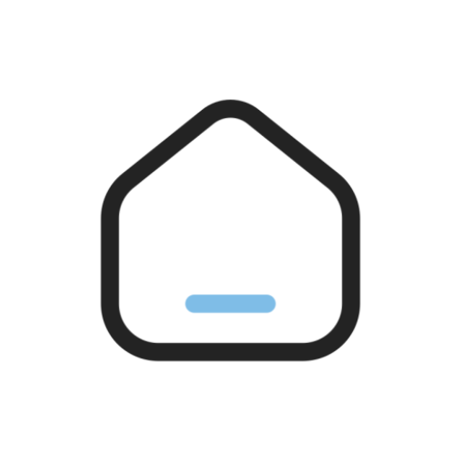
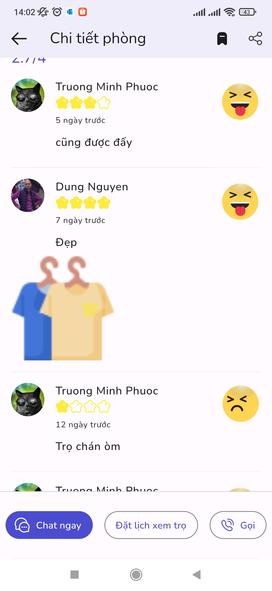
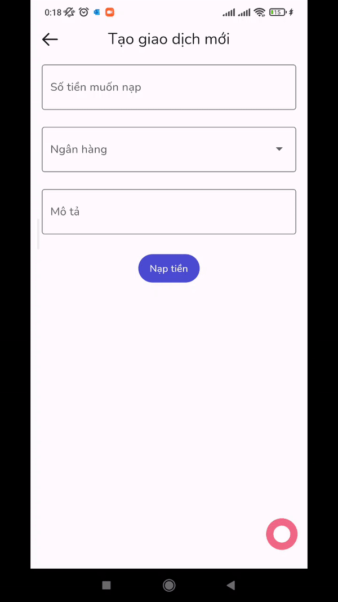

![coverage][coverage_badge]
[![style: very good analysis][very_good_analysis_badge]][very_good_analysis_link]
[](https://github.com/felangel/mason)
[![License: MIT][license_badge]][license_link]

[](https://github.com/hovanvydut/pbl6-mobile/releases)


# Homie - INN Findor System - Client Mobile App



An INN Findor System mobile app created by PBL6 Team

Initially generated by the [Very Good CLI][very_good_cli_link] 🤖

## Features 🔥

- Authentication, select role, submit register email.
- Role Permission.
- Create, View, Delete, Edit, Search, Filter, Uptop Rental post.
- Review post, create booking to view rental house.
- Review evaluation analysis.
- User management.
- User post management.
- Booking management.
- Bookmark management.
- Statistics.
- Payment management (VNPAY).
- Notifications.
- Dark mode support.

## Core structure used 🔬

- Very Good Ventures's Boring Structure, check out in this [link](https://verygood.ventures/blog/very-good-flutter-architecture) to learn more about app architecture.
- Multi-package (Mono repo).

## Technologies used 💪

- [flutter_bloc](https://pub.dev/packages/flutter_bloc) for state management solution.
- Service locator using [get_it](https://pub.dev/packages/get_it) and DI via Widget Tree.
- [go_router](https://pub.dev/packages/go_router) for routing solution, deep link.
- Structure templates using [Mason](https://brickhub.dev) brick with [own implementation](https://github.com/dungngminh/mason_bricks) and Very Good Ventures bricks.
- Secure Storage via [flutter_secure_storage](https://pub.dev/packages/flutter_secure_storage).
- [http](https://pub.dev/packages/http) ([customized](https://pub.dev/packages/http_client_handler) wrapper for http session) for api call.

## Design System/UI-UX ️🎨

- [Material Design 3](https://m3.material.io/) (some widgets aren't supported will be customized).
- [Material 3 Dynamic Color](https://m3.material.io/theme-builder#/custom).

## Environment 🚀

This project contains 2 flavors:

- development
- production

To run the desired flavor either use the launch configuration in VSCode/Android Studio or use the following commands with env variables:

```sh
# Development
$ flutter run --flavor development --target lib/main_development.dart --dart-define BASE_URL="your_development_url"
``
# Production
$ flutter run --flavor production --target lib/main_production.dart --dart-define BASE_URL="your_production_url"
```

## Screenshots 📷

| Home Page                                                                                                              | Sign in                                                                                                                  | Select Role                                                                                                                      |
| ---------------------------------------------------------------------------------------------------------------------- | ------------------------------------------------------------------------------------------------------------------------ | -------------------------------------------------------------------------------------------------------------------------------- |
|            |                      |                  |
| Sign up                                                                                                                | Detail Post                                                                                                              | Search                                                                                                                           |
|              |          |              |
| Filter                                                                                                                 | Detail Host                                                                                                              | Review Session                                                                                                                   |
|                  |          |            |
| Create Review                                                                                                          | Create Booking                                                                                                           | Select Booking Calendar                                                                                                          |
|    |  |  |
| User Panel                                                                                                             | User Info                                                                                                                | User Post                                                                                                                        |
|          |              |                      |
| Post Action                                                                                                            | Booking List                                                                                                             | Config Freetime                                                                                                                  |
|        |        |          |
| Bookmark                                                                                                               | Account/Debit/Credit History                                                                                             | Notifications                                                                                                                    |
|              |                  |              |
| Create Payment                                                                                                         | Stat                                                                                                                     | Home Page dark mode                                                                                                              |
|  |                        |            |

## Platforms 📦

- Android
- iOS

### Android

<a href='https://play.google.com/store/apps/details?id=me.dungngminh.pbl6_mobile'>
</a>

### iOS (Coming soon)

## Contributor 🌟

<table>
  <tr>
    <td align="center"><br /><sub><b>Nguyen Minh Dung</b></sub></a><br /><a href="https://github.com/hovanvydut/pbl6-mobile/commits?author=dungngminh" title="Mobile Dev">💻📱</a> 
    <td align="center"><br /><sub><b>Ho Van Vy</b></sub></a><br /><a href="https://github.com/hovanvydut/pbl6-mobile/commits?author=hovanvydut" title="Devops">🛠</a>
</tr>

</table>

[coverage_badge]: coverage_badge.svg
[flutter_localizations_link]: https://api.flutter.dev/flutter/flutter_localizations/flutter_localizations-library.html
[internationalization_link]: https://flutter.dev/docs/development/accessibility-and-localization/internationalization
[license_badge]: https://img.shields.io/badge/license-MIT-blue.svg
[license_link]: https://opensource.org/licenses/MIT
[very_good_analysis_badge]: https://img.shields.io/badge/style-very_good_analysis-B22C89.svg
[very_good_analysis_link]: https://pub.dev/packages/very_good_analysis
[very_good_cli_link]: https://github.com/VeryGoodOpenSource/very_good_cli
